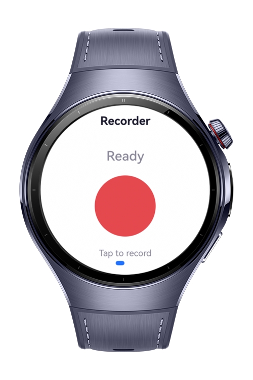
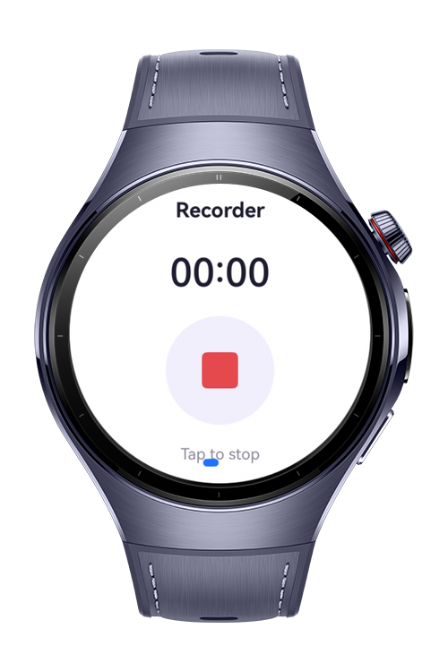
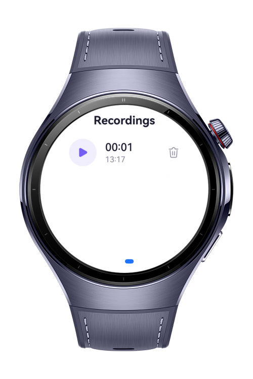

> **Note:** To access all shared projects, get information about environment setup, and view other guides, please visit [Explore-In-HMOS-Wearable Index](https://github.com/Explore-In-HMOS-Wearable/hmos-index).

# Audio Recorder For Smart Wearables

This sample shows an example of a voice recorder that captures microphone audio with AudioCapturer, writes it to disk as a playable WAV file, and plays it back with AVPlayer. Raw PCM frames are written directly to a file descriptor, and a 44-byte RIFF/WAVE header is patched in once the total size is known. Recording duration is derived from file size rather than stored separately.

# Preview

<div>
  
  
  
</div>

# Use Cases

* Microphone capture with AudioCapturer using a raw PCM stream (16 kHz, mono, 16-bit)
* Writing a valid WAV file by reserving a header and seeking back to fill it on stop
* Playback of recorded files with AVPlayer driven by its stateChange lifecycle
* File management with fileIo for creating, listing, and deleting recordings in the app sandbox
* Handling audio interrupts and output device changes during capture and playback

# Technology

## Stack
* Languages: ArkTS
* Framework: HarmonyOS SDK 6.1.1(24)
* Tools: DevEco Studio 6.1.1 Release
* Libraries:
	@kit.AudioKit
	@kit.MediaKit
	@kit.CoreFileKit
	@kit.AbilityKit
	@kit.BasicServicesKit

## Required Permissions

* `ohos.permission.MICROPHONE`
  Required to capture audio from the microphone.

# Directory Structure

```
.\entry\src\main
│   module.json5
│
├───ets
│   ├───common
│   │       Permissions.ets
│   │       PlayerEngine.ets
│   │       RecorderEngine.ets
│   │       RecordingStore.ets
│   │
│   ├───entryability
│   │       EntryAbility.ets
│   │
│   ├───pages
│   │       Index.ets
│   │
│   └───view
│           RecordView.ets
│           RecordingsView.ets
│
└───resources
    └───base
        ├───element
        │       color.json
        │       string.json
        │
        └───profile
                main_pages.json
```

# Constraints and Restrictions

DevEco Studio Simulator is not supported, as microphone capture requires a physical device.

Recordings are stored uncompressed in the application sandbox, which consumes roughly 32 KB per second of audio and is removed when the application is uninstalled.

## Supported Devices

* Huawei Watch 5

# License

Audio Recorder For Smart Wearables is distributed under the terms of the MIT License. See the [LICENSE](https://github.com/Explore-In-HMOS-Wearable/wear-rec/blob/main/LICENSE) for more information.
